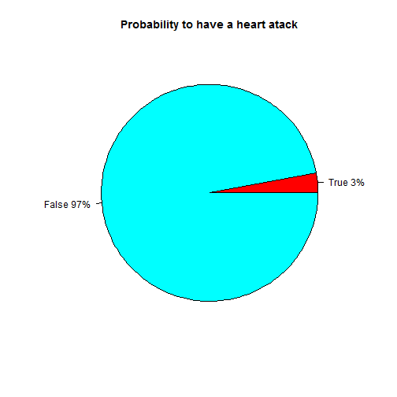

Risk Assessment Tool for Estimating Your 10 years Risk of Having a Heart Attack
========================================================
author: Laura Ovesia 
date: Jan 30, 2016

First Slide
========================================================

For more details on authoring R presentations click the
**Help** button on the toolbar.

- Bullet 1
- Bullet 2
- Bullet 3

Database Structure
========================================================


```
'data.frame':	4240 obs. of  8 variables:
 $ age          : int  39 46 48 61 46 43 63 45 52 43 ...
 $ male         : int  1 0 1 0 0 0 0 0 1 1 ...
 $ totChol      : int  195 250 245 225 285 228 205 313 260 225 ...
 $ currentSmoker: int  0 0 1 1 1 0 0 1 0 1 ...
 $ diabetes     : int  0 0 0 0 0 0 0 0 0 0 ...
 $ sysBP        : num  106 121 128 150 130 ...
 $ BPMeds       : int  0 0 0 0 0 0 0 0 0 0 ...
 $ TenYearCHD   : int  0 0 0 1 0 0 1 0 0 0 ...
```

Sample results
========================================================

 
Conclusions
========================================================
The provided app here allows the user to:


App URL: https://laurao.shinyapps.io/

Documentation and Code: https://github.com/

